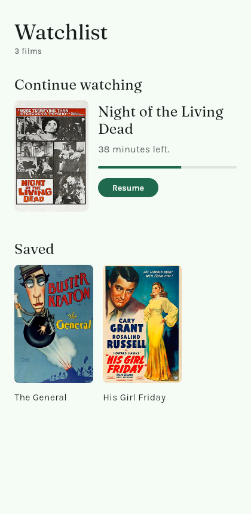
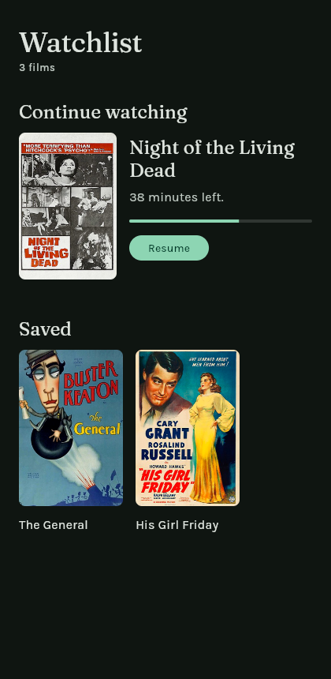
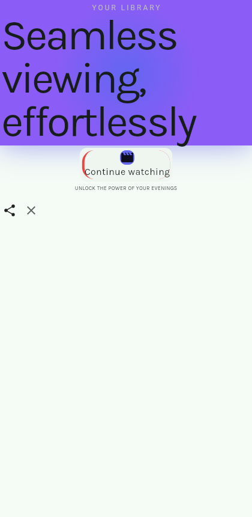
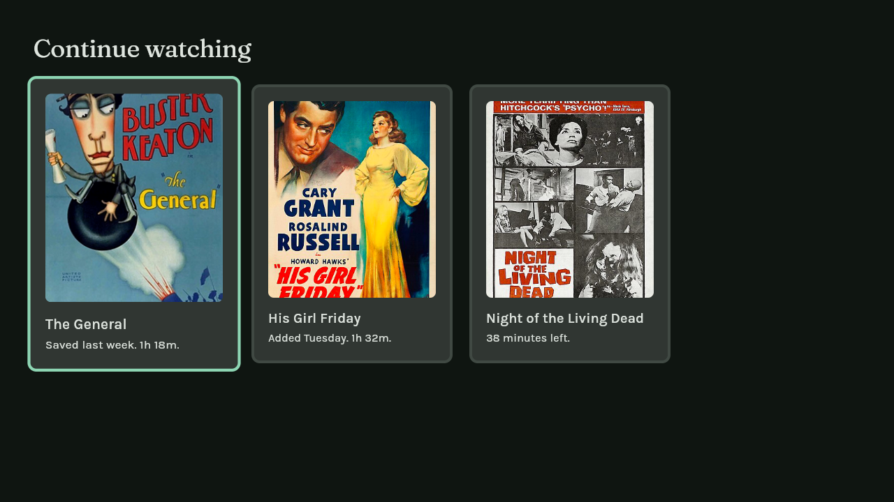

# Watchlist

A example for impeccable-flutter: the same screen built twice, plus the TV version of it.

| File | Target | Findings |
|---|---|---|
| `lib/screens/library_before.dart` | phone | 47, across 6 errors and 39 warnings |
| `lib/screens/library_after.dart` | phone | none |
| `lib/screens/library_tv.dart` | tv | none |
| `lib/theme.dart` | any | none |

Check it yourself from the repo root:

```bash
make example
```

## What it looks like

| Phone, light | Phone, dark |
|---|---|
|  |  |

The before version of the same screen:



The TV screen, with the first tile focused:



Every one is a real render captured from the running app. `tool/screenshots.sh` rebuilds and recaptures them. It needs Flutter and Chrome, and it is the only part of this repo that does.

## What ships here

Source only. There are no `android/` or `ios/` folders, because this repo deliberately has no Flutter toolchain, and the detector is plain Dart that stays that way.

To run it, either copy `lib/` into a Flutter app of your own, or generate the platform folders in place:

```bash
cd examples/watchlist
flutter create --platforms=android,ios .
flutter run
```

Fonts and posters are committed, so it runs as it stands. Both faces are under the SIL Open Font License and the three posters are public domain, with sources in `fonts/README.md` and `assets/posters/README.md`. `library_after.dart` handles a failed load with `errorBuilder`, so swapping the images or deleting them both render.

## What the after version does differently

Passing the rules is the floor. What carries the screen is above it.

**The artwork leads.** One resumable film gets room, a progress line and a button; everything else is a rail of posters you flick through. A uniform list of the same row repeated would have passed every rule and decided nothing.

**Two faces doing different jobs.** Fraunces carries the headings and the film title, Karla carries meta and labels. The contrast is what stops it reading like a settings screen.

**Rhythm, not even spacing.** 4 between a heading and its count, 12 inside a group, 32 and 48 between sections. Even gaps are what make a screen feel unconsidered.

The mechanics underneath, each mapping to a playbook:

Colour and type come from `Theme.of(context)`, never a literal. The values live in `lib/theme.dart`, and every one is declared in `DESIGN.md`, so the `design-system-*` rules check the app against its own documented system. See `theme.md`.

Layout branches on `LayoutBuilder` constraints, so split view and foldables work without a special case. See `adapt.md`.

The empty state says what goes there and how to put the first one in, because it is the screen a new user sees first. See `harden.md`.

Posters carry `cacheWidth` so a 132-pixel image is not decoded at full size, and an `errorBuilder` so a failed load is a placeholder. Tap targets clear 48 logical pixels, rows are wrapped in `Semantics` with real labels, and every text has `maxLines` with an ellipsis.

## What the TV version does differently

TV is its own design problem. See `tv.md`.

Focus is the cursor, so every tile is a `FocusableActionDetector` that changes scale and border colour when focused. Scale alone is not enough across a room, and colour alone fails for colour-blind viewers, so it does both.

The first tile takes focus with `autofocus`, or the first press of the remote does nothing and the app reads as frozen.

Content sits inside a 48-pixel margin, which is the 5% overscan band a TV panel may crop. `SafeArea` does not cover this.

Type comes from the same theme, at sizes meant for three metres.

## The before version

Kept because the difference is the point. It trips 47 findings including a radial glow, nested cards, a side-tab border, an icon tile above a heading, justified all-caps text at 9 logical pixels, a 32-pixel tap target, an unlabeled icon button, an undeclared font and asset, elastic easing, and a `ListView` inside a `Column` that throws at runtime.

Do not fix it.
